# XML Sitemap

Auto-generated sitemap for search engines.

```mermaid
graph LR
    A[🌐 Your Site] --> B[🗺️ Sitemap]
    B --> C[🔍 Google]
    B --> D[🔍 Bing]
    
    style A fill:#6366F1,stroke:#7C90A0,color:#fff
    style B fill:#F59E0B,stroke:#7C90A0,color:#fff
    style C fill:#10B981,stroke:#7C90A0,color:#fff
    style D fill:#10B981,stroke:#7C90A0,color:#fff
```



## What It Does

Creates a `sitemap.xml` file that lists all your pages for search engines.

## Sitemap URL

```
https://yoursite.com/sitemap.xml
```

## Included Content

| Content Type | Included |
|--------------|----------|
| Posts | ✅ |
| Pages | ✅ |
| Categories | ✅ |
| Tags | Optional |

## Submit to Google

1. Go to [Google Search Console](https://search.google.com/search-console)
2. Select your site
3. Go to **Sitemaps**
4. Enter `sitemap.xml`
5. Click **Submit**

## Auto-Updates

The sitemap updates automatically when you publish or update content.
