# Configuration

Set up your SEO settings.

```mermaid
graph LR
    A[⚙️ Settings] --> B[📝 Meta]
    A --> C[🗺️ Sitemap]
    A --> D[📊 Analytics]
    
    style A fill:#6366F1,stroke:#7C90A0,color:#fff
    style B fill:#10B981,stroke:#7C90A0,color:#fff
    style C fill:#F59E0B,stroke:#7C90A0,color:#fff
    style D fill:#8B5CF6,stroke:#7C90A0,color:#fff
```

## Access Settings

Go to **SEO WordPress** in your admin sidebar.

## Dashboard Tabs

| Tab | Purpose |
|-----|---------|
| **Dashboard** | Overview & quick settings |
| **Authorship** | Google authorship setup |
| **XML Sitemap** | Sitemap configuration |
| **Breadcrumbs** | Navigation breadcrumbs |
| **RSS** | RSS feed settings |

## Verification Codes

Add your verification codes:

- ✅ Google Webmaster Tools
- ✅ Bing Webmaster Tools
- ✅ Alexa

## Google Analytics

Paste your Analytics tracking ID to enable tracking.

## Done!

Your SEO is now configured. [Learn about meta optimization →](../features/meta-optimization.md)
