# Installation

Get Praison SEO running in 2 minutes.

```mermaid
graph TB
    A[📥 Download] --> B[📤 Upload]
    B --> C[✅ Activate]
    C --> D[🎉 Done!]
    
    style A fill:#6366F1,stroke:#7C90A0,color:#fff
    style B fill:#F59E0B,stroke:#7C90A0,color:#fff
    style C fill:#189AB4,stroke:#7C90A0,color:#fff
    style D fill:#10B981,stroke:#7C90A0,color:#fff
```

## Option 1: WordPress Admin

1. Go to **Plugins → Add New**
2. Search for "Praison SEO"
3. Click **Install Now**
4. Click **Activate**

## Option 2: Manual Upload

1. Download the plugin ZIP
2. Go to **Plugins → Add New → Upload Plugin**
3. Choose the ZIP file
4. Click **Install Now**
5. Click **Activate**

## Next Step

→ [Configure SEO settings](configuration.md)
