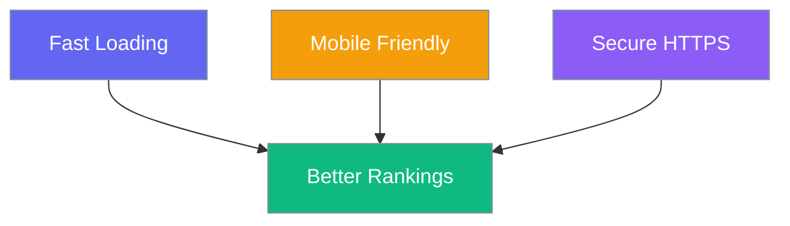

# SEO Best Practices

Get the most out of Praison SEO.

## Content Optimization

| Practice | Why |
|----------|-----|
| 📝 Unique titles | Each page needs a unique title |
| 📋 Meta descriptions | Write compelling 150-160 char descriptions |
| 🔗 Internal links | Link between your pages |
| 📸 Image alt text | Describe your images |

## Technical SEO

## Checklist

- [ ] Install and activate plugin
- [ ] Add Google Analytics
- [ ] Submit sitemap to Google
- [ ] Verify with Google Search Console
- [ ] Write meta descriptions for top pages
- [ ] Enable breadcrumbs
- [ ] Set canonical URLs

## Avoid These Mistakes

!!! warning "Don't stuff keywords"
    Write naturally. Google penalizes keyword stuffing.

!!! warning "Don't duplicate content"
    Each page should have unique content.

!!! warning "Don't ignore mobile"
    Over 50% of traffic is mobile.
