# Troubleshooting

Common issues and fixes.

```mermaid
graph TB
    P[🔴 Problem]
    P --> C1{Meta not showing?}
    P --> C2{Sitemap error?}
    P --> C3{Analytics not working?}
    
    C1 --> S1[✅ Clear cache]
    C2 --> S2[✅ Check permalinks]
    C3 --> S3[✅ Verify tracking ID]
    
    style P fill:#8B0000,stroke:#7C90A0,color:#fff
    style C1 fill:#F59E0B,stroke:#7C90A0,color:#fff
    style C2 fill:#F59E0B,stroke:#7C90A0,color:#fff
    style C3 fill:#F59E0B,stroke:#7C90A0,color:#fff
    style S1 fill:#10B981,stroke:#7C90A0,color:#fff
    style S2 fill:#10B981,stroke:#7C90A0,color:#fff
    style S3 fill:#10B981,stroke:#7C90A0,color:#fff
```

## Meta Tags Not Showing

**Cause:** Caching or theme conflict

**Fix:**
1. Clear your cache plugin
2. Check if theme has its own SEO output
3. View page source to verify tags exist

## Sitemap 404 Error

**Cause:** Permalink issue

**Fix:**
1. Go to **Settings → Permalinks**
2. Click **Save Changes** (triggers rewrite rules)
3. Try sitemap URL again

## Analytics Not Tracking

**Cause:** Missing or wrong tracking ID

**Fix:**
1. Verify your tracking ID format
2. Check if another plugin is adding Analytics
3. Wait 24-48 hours for data to appear

## Plugin Conflict

**Fix:**
1. Deactivate other plugins
2. Test one by one
3. Identify the conflict

## Still Stuck?

[Open an issue on GitHub](https://github.com/MervinPraison/seo-wordpress/issues)
