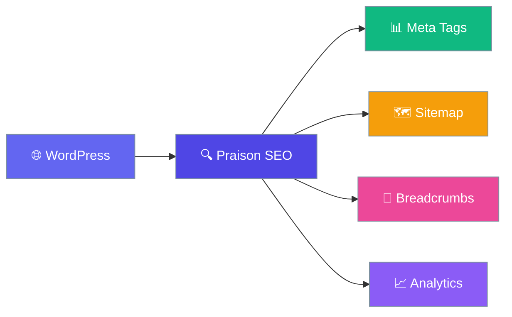

# Praison SEO WordPress

The most powerful SEO plugin for WordPress.

## Quick Start

1. **Install** → Upload plugin to WordPress
2. **Activate** → Go to Plugins → Activate
3. **Configure** → SEO settings in admin panel

That's it! 🎉

## Features

| Feature | Description |
|---------|-------------|
| 📝 Meta Optimization | Title & description for every page |
| 🗺️ XML Sitemap | Auto-generated sitemap |
| 🍞 Breadcrumbs | Navigation trail |
| 📊 Analytics | Google Analytics integration |
| ✅ Webmaster Tools | Google, Bing, Alexa verification |
| 🔗 Canonical URLs | Prevent duplicate content |

## Next Steps

- [Installation Guide](getting-started/installation.md)
- [Configuration](getting-started/configuration.md)
- [Meta Optimization](features/meta-optimization.md)
